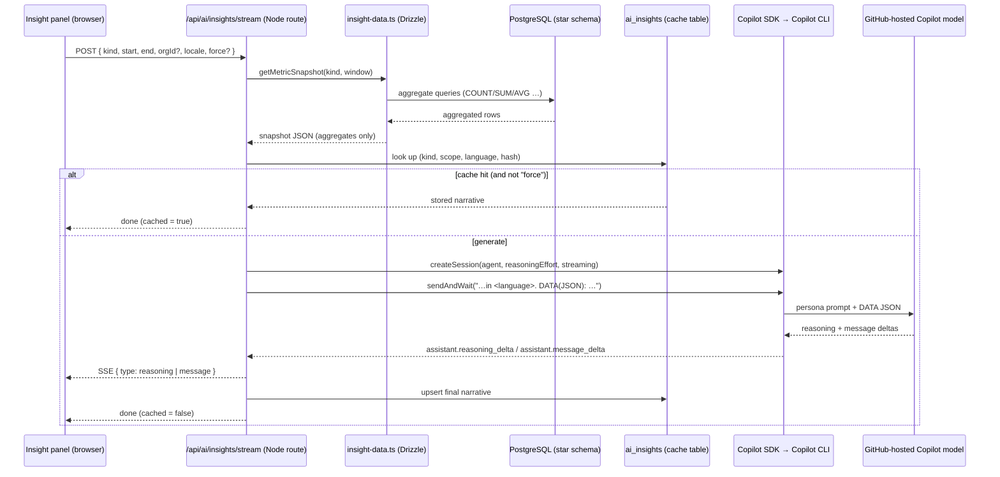

# AI Analyst — Transparency Report

The **AI Analyst** turns your existing GitHub Copilot usage data into written analysis: an
executive briefing, cost/license optimization, adoption coaching, delivery impact, return-on-
investment (ROI) with a spend forecast, and per-team scorecards. This document explains—​in full—​
**exactly how it works**: what data is gathered, what is (and is not) sent to the model, the precise
prompts used, how the analysis is produced, and how results are cached, secured, and billed.

It is written so a reviewer, security team, or end user can verify the behavior against the code.
Every section points at the source file that implements it.

> **Status: Experimental.** AI Analyst output is generated by a large language model. It can be
> incomplete or wrong. Always verify before acting on it.

---

## 1. The core principle: grounded, not generated, numbers

**The model never computes or invents metrics. Your database does.**

Every number the AI Analyst talks about is calculated by SQL (Drizzle ORM) over the star schema and
passed to the model as a small JSON object. The model's only job is to **interpret and narrate**
that data—​not to do arithmetic and not to fetch anything itself.

This is enforced in three independent ways:

1. **No tools.** The model session is created with an **empty tool set** (`availableTools: []`) and a
   **deny-everything** permission guard, so the model cannot run shell commands, read/write files,
   call URLs, or query the database. It only sees the JSON we hand it.
2. **Pre-computed payload.** All figures are aggregated in SQL before the prompt is built
   (`app/src/lib/ai/insight-data.ts`).
3. **Prompt instruction.** Every agent prompt says: *"Use ONLY the numbers in the DATA provided …
   Never invent or estimate metrics."*

---

## 2. End-to-end flow



**Key files**

| Concern | File |
|---|---|
| Data gathering (SQL → JSON) | `app/src/lib/ai/insight-data.ts` |
| Agent personas & prompts | `app/src/lib/ai/agents.ts` |
| Generation, caching, streaming | `app/src/lib/ai/insights.ts` |
| Copilot client (in-process CLI) | `app/src/lib/ai/copilot-client.ts` |
| Permission guard (deny-all) | `app/src/lib/ai/tools.ts` |
| Reasoning-effort resolution | `app/src/lib/ai/models.ts` |
| Streaming SSE endpoint | `app/src/app/api/ai/insights/stream/route.ts` |
| Non-streaming endpoint | `app/src/app/api/ai/insights/route.ts` |
| Feature status | `app/src/app/api/ai/status/route.ts` |
| Settings (token, model, on/off) | `app/src/app/api/settings/ai-analyst/route.ts` |
| AI cache status / clear | `app/src/app/api/settings/ai-analyst/cache/route.ts` |
| Enterprise context status | `app/src/app/api/settings/ai-analyst/context/route.ts` |
| Metric display-name glossary | `app/src/lib/ai/metric-glossary.ts` |
| UI card + reasoning trace | `app/src/components/ai/insight-panel.tsx` |
| Cache table schema | `app/src/lib/db/schema.ts` (`ai_insights`) |

---

## 3. What data is gathered (and what is **not**)

There are six "insight kinds." Each has a dedicated builder in `insight-data.ts` that returns a
small, JSON-serializable object of **aggregates**. The builders read these persisted tables:
`fact_copilot_usage_daily`, `fact_ai_credit_usage`, `fact_org_aggregate_daily`, `fact_user_language_daily`,
`fact_user_ide_daily`, `fact_user_model_daily`, `dim_user`, `dim_org`, `dim_org_member`,
`dim_enterprise`, `dim_enterprise_team`, `dim_enterprise_team_member`, `fact_copilot_seat_assignment`,
and `github_access_check_snapshot`.

> **No personal data is sent to the model.** User IDs are used only inside SQL for
> `COUNT(DISTINCT …)` and cohort/team grouping. They are **never included** in the JSON payload. No
> user logins, names, emails, repository names, or code are sent to the model — only counts, sums,
> averages, rates, model names, organization names, and enterprise team names.
>
> **Clarifications for newer context:** team scorecards include enterprise **team names** and
> enterprise context includes **organization names**; these are organizational labels, not user
> identities. The **ROI & forecast** payload includes clearly-labeled **assumption constants** and can
> also include admin-provided additional assumptions. Any assumption-derived ROI figure must be
> labeled as an estimate.

### 3.0 Shared enterprise context included with every snapshot

Every insight payload now includes `enterpriseContext`, a compact, persisted snapshot of the
enterprise shape and data health:

| Group | Meaning | Source |
|---|---|---|
| `enterprise` | configured enterprise slug + stored enterprise rows | `app_settings`, `dim_enterprise` |
| `topology` | org count, synced team count, synced team-member count, licensed users, active users, utilization | dimensions + usage facts |
| `orgScorecards[]` | per-org member count, active users, interactions, AI Credits used, and efficiency ratios | `dim_org`, `dim_org_member`, `dim_user`, `fact_copilot_usage_daily` |
| `seatAssignmentSignals` | persisted seat assignment snapshot date, plan counts, assignment method counts, idle/never-active/pending-cancellation counts when available | `fact_copilot_seat_assignment` |
| `accessHealth` | latest Check access result, token health, failed endpoint checks | `github_access_check_snapshot` |
| `featureMix` | chat / CLI / agent / code-review adoption, plus top languages, editors, and models | usage facts + language/IDE/model facts |
| `contextWarnings[]` | missing org/team/seat/access context warnings | derived |

Seat assignment details are **not fetched live during AI generation**. They are persisted when the
seats page or data sync calls the live GitHub seats API. If the seats endpoint is unavailable (for
example, GitHub returns 404 for the configured enterprise/token), the sync continues and the AI
payload marks seat assignment context as unavailable rather than inventing it.

The window comes from the report's date-range filter (or defaults to the last 28 days). An optional
single `orgId` scopes usage-based metrics.

### 3.1 `cost_license` — Cost & License Analyst

| Field | Meaning | Source |
|---|---|---|
| `licensedUsers` | Current licensed users | `COUNT(*)` of `dim_user` where `is_current` |
| `activeUsers` | Users with ≥1 user-initiated interaction in window | distinct `user_id` in `fact_copilot_usage_daily` |
| `idleSeats` | `licensedUsers − activeUsers` | derived |
| `totalNetSpend` | Net AI-credit spend in window | `SUM(net_amount)` of `fact_ai_credit_usage` |
| `spendByModel` | Top 10 models by net spend (`model`, `netAmount`) | grouped by `model` |
| `businessSignals` | license risk, spend concentration risk, and primary savings opportunity | derived |
| `dataQuality` | sample size, evidence completeness, readiness rationale, warnings | derived |

### 3.2 `adoption` — Adoption Coach

| Field | Meaning |
|---|---|
| `totalClassifiedUsers` | Users with a latest adoption phase in window |
| `cohorts[]` | Per phase (no cohort, code-first, agent-first, multi-agent): `users` count |
| `stageMix` | early/no-cohort users, advanced users, share percentages |
| `businessSignals` | dominant cohort, maturity, primary enablement focus |
| `dataQuality` | sample size, evidence completeness, warnings |

Each user is bucketed by their **latest** `ai_adoption_phase` within the window
(`SELECT DISTINCT ON (user_id) … ORDER BY day DESC`).

### 3.3 `executive` — Executive Briefer (comprehensive, cross-cutting)

This is the richest snapshot. It spans every area and adds a **previous equal-length period**
comparison and an **in-window weekly trajectory**, so the briefer can describe *what changed*.

| Group | Fields |
|---|---|
| `window`, `previousWindow` | the current and immediately-preceding equal-length date ranges |
| `engagement` | latest DAU / WAU / MAU (enterprise aggregate), `stickinessDauOverMau` |
| `activity` | activeUsers, interactions, codeGenerated, codeAccepted, acceptanceRate, linesOfCodeAdded — each with the previous-period value and % change (acceptance as a percentage-point delta) |
| `licensing` | licensedUsers, activeUsers, idleSeats, utilizationPct |
| `cost` | netSpend (+ previous + % change), spendPerActiveUser, topModelsBySpend (top 5) |
| `delivery` | prCreated/merged/reviewed (+ % changes), copilotAuthoredPrs, copilotReviewedPrs, copilotAppliedSuggestions, avgMedianMinutesToMerge |
| `adoption` | totalClassifiedUsers + cohort counts |
| `weeklyTrend[]` | per ISO week: activeUsers, interactions |
| `businessSignals` | activity, productivity, spend, and delivery trend labels; adoption maturity; top risk; recommended executive decision |
| `dataQuality` | sample size, evidence completeness, warnings |

A representative (numbers illustrative) executive payload:

```jsonc
{
  "window": { "start": "2026-05-25", "end": "2026-06-21" },
  "previousWindow": { "start": "2026-04-27", "end": "2026-05-24" },
  "engagement": { "latestDailyActiveUsers": 312, "latestWeeklyActiveUsers": 870,
                  "latestMonthlyActiveUsers": 1240, "stickinessDauOverMau": 0.25 },
  "activity": { "activeUsers": 980, "activeUsersPrev": 910, "activeUsersChangePct": 7.7,
                "acceptanceRate": 0.31, "acceptanceRatePrev": 0.28, "acceptanceRatePointDelta": 3.0,
                "linesOfCodeAdded": 184302, "linesOfCodeAddedChangePct": 12.4 },
  "licensing": { "licensedUsers": 1500, "activeUsers": 980, "idleSeats": 520, "utilizationPct": 65.3 },
  "cost": { "netSpend": 4210.55, "netSpendPrev": 3560.10, "netSpendChangePct": 18.3,
            "spendPerActiveUser": 4.30, "topModelsBySpend": [{ "model": "…", "netAmount": 1890.20 }] },
  "delivery": { "prCreated": 4120, "prMerged": 3380, "copilotAuthoredPrs": 612,
                "avgMedianMinutesToMerge": 240.5 },
  "adoption": { "totalClassifiedUsers": 980, "cohorts": [{ "key": "codeFirst", "users": 420 }] },
  "weeklyTrend": [{ "week": "2026-05-25", "activeUsers": 540, "interactions": 18230 }]
}
```

### 3.4 `delivery` — Delivery Impact Analyst

Pull-request throughput at **enterprise scope** from `fact_org_aggregate_daily`: `prCreated`,
`prMerged`, `prReviewed`, `copilotAuthoredPrs`, `copilotReviewedPrs`, `copilotSuggestions`,
`copilotAppliedSuggestions`, `avgMedianMinutesToMerge`, plus Copilot-authored/reviewed shares,
suggestion application rate, previous-period movement, delivery signal, and data caveats.

### 3.5 `roi_forecast` — ROI & Forecast Analyst

Value drivers, cost, and a spend forecast for the window, plus a block of editable assumptions so the
model can compute a **transparent ROI estimate** without inventing measured numbers.

| Group | Fields |
|---|---|
| `window`, `daysInWindow` | the date range and its length |
| `value` | activeUsers, interactions, codeGenerated, codeAccepted, acceptanceRate, linesOfCodeAdded, copilotAuthoredPrs, copilotReviewedPrs, copilotAppliedSuggestions, avgMedianMinutesToMerge, plus activeUsers / codeAccepted % change vs the previous period |
| `licensing` | licensedUsers, activeUsers, idleSeats, utilizationPct |
| `cost` | netSpend (+ previous + % change), avgDailyNetSpend, projected30DaySpend, projectedAnnualSpend, weeklyNetSpend[] |
| `assumptions` | minutesSavedPerAcceptedSuggestion (1.5), developerHourlyCostUsd (75), monthlyCostPerSeatUsd (19), and a note |
| `computedEstimates` | estimated hours saved, estimated value, fully loaded cost, net value, ROI ratio, break-even hours, idle-seat cost |
| `businessSignals` | ROI judgment, spend trend, forecast risk, primary action |
| `dataQuality` | sample size, evidence completeness, warnings |

The forecast figures are simple, auditable run-rate projections (average daily net spend × 30 / 365).
The assumptions are **defaults you can change** — every ROI number the model states is derived from
them and explicitly labeled as an estimate.

### 3.6 `team_scorecards` — Team Scorecard Analyst

Per-team scorecards so leaders can compare adoption and cost across teams. Activity and AI-credit
consumption are attributed to each **enterprise team** via its roster
(`dim_enterprise_team_member`); the payload includes team names but **no user identities**.

| Field (per team, top 15 by credits) | Meaning |
|---|---|
| `team` | enterprise team name |
| `rosterSize`, `activeMembers`, `utilizationPct` | roster size, members active in the window, and their ratio |
| `agentAdopters` | distinct members who used an agent (`used_agent`) |
| `creditsUsed` | `SUM(ai_credits_used)` over the team's members (Copilot Usage Metrics signal) |
| `interactions`, `acceptanceRate` | activity volume and accepted ÷ generated |
| `creditsPerActiveMember`, `creditsPerInteraction` | cost-efficiency ratios |
| `segment`, `benchmark` | leader / cost watch / underutilized / enablement candidate + median comparisons |
| `businessSignals`, `benchmarks`, `dataQuality` | leading/cost-watch/underutilized teams, medians, evidence caveats |

Empty when no enterprise teams have been synced (the agent then says teams must be synced first).

---

## 4. The prompt

A generation uses two pieces of prompt: the **agent persona** (system-level instructions, registered
as a Copilot SDK custom agent) and the **per-request user message** (the language directive + the
DATA JSON).

### 4.1 Shared grounding rules

All agents share an expanded grounding and output contract (`app/src/lib/ai/agents.ts`):

- write in the requested UI language;
- use only numbers present in `DATA`;
- distinguish **measured**, **derived**, and **assumption-based estimate** values;
- use `businessSignals`, `computedEstimates`, `benchmarks`, and `dataQuality` as interpretation cues;
- use `enterpriseContext` to personalize recommendations to orgs, teams, seat assignment context,
  access health, and feature mix;
- use the **metric glossary** to show friendly metric names instead of raw JSON keys like
  `licensedUsers` or `codeReviewSharePct`;
- avoid raw JSON, code fences, implementation details, and salesy language;
- produce structured Markdown with a key metrics section, risks, recommendations, and
  **analysis confidence**.

Important distinction: `dataQuality.evidenceCompletenessPct` is **not** a confidence score. It is a
data-readiness signal. The model is asked to produce its own **analysis confidence** (High/Medium/Low
plus 0-100%) based on signal consistency, ambiguity, alternative explanations, and caveats.

### 4.2 Agent personas

| Agent (`name`) | Persona summary |
|---|---|
| `cost-license-analyst` | "FinOps-minded analyst … Call out idle seats and the spend they represent, the biggest AI-credit spend drivers by model, and 2-3 concrete savings actions." + grounding |
| `adoption-coach` | "Enablement coach … Summarize adoption across the cohorts … who looks ready to graduate … and 2-3 enablement actions." + grounding |
| `delivery-analyst` | "Software delivery analyst … Copilot's impact on delivery: PR volume, Copilot-authored/reviewed PRs, applied suggestions, time-to-merge. State the productivity signal and one caveat." + grounding |
| `executive-briefer` | Comprehensive strategic briefing (see below) |
| `roi-forecaster` | "FinOps and value-realization analyst … quantify value and forecast spend, and show the math: value realized, fully-loaded cost, an ROI judgment, a run-rate forecast, and 2-3 actions — every assumption stated and labeled as an estimate." |
| `team-scorecard-analyst` | "Enablement strategist … compare per-team scorecards: leading teams to replicate, lagging teams and why, cost-vs-value outliers, and targeted enablement per segment." |

All personas also inherit metric-language guardrails and enterprise-context guidance. The prompt
version is exported as `AI_ANALYST_PROMPT_VERSION`; changing it invalidates old cached narratives.

### 4.3 The executive briefer prompt (verbatim intent)

The executive agent is **not** concise — it is asked to analyze, not restate, and to produce a
structured Markdown briefing with six bold sections:

1. **Executive headline** — is Copilot delivering value, the trajectory, and the one thing to act on.
2. **Value & ROI** — productivity, delivery acceleration, and cost efficiency, with an explicit ROI
   judgment. Any time/dollar estimate must state its assumption rather than invent a measured figure.
3. **Adoption health & momentum** — utilization, idle seats, cohort distribution, weekly trajectory,
   stickiness; whether adoption is growing, plateauing, or concentrated — and why.
4. **Where to drive more adoption** — 3-4 prioritized opportunities tied to numbers.
5. **Challenges & how to unblock** — likely blockers inferred from the data + concrete fixes.
6. **Recommended actions** — ranked 3-5 next steps with expected ROI/adoption impact.

It is explicitly allowed to make **reasoned inferences and clearly-labeled assumptions** for ROI,
but must **never present an invented number as if it were measured**. The full text lives in
`INSIGHT_AGENTS.executive.prompt`.

### 4.4 The per-request user message

Built in `app/src/lib/ai/insights.ts`:

```text
Produce your analysis from this data. Write the entire response — including every section heading —
in <Language>.

ADMIN-PROVIDED ADDITIONAL INSTRUCTIONS / ASSUMPTIONS:
<optional admin text>

METRIC GLOSSARY (raw field name → display name):
<friendly metric labels>

DATA (JSON):
<the snapshot object from §3>
```

`<Language>` is derived from the current UI locale: English, Arabic, Spanish, French, German, Hindi,
or Italian. The optional admin block comes from **Settings → AI Analyst → Additional instructions &
assumptions** and is treated as enterprise context only when it does not conflict with the grounding
rules or measured `DATA`.

---

## 5. How the analysis is produced (execution)

`app/src/lib/ai/insights.ts` → `app/src/lib/ai/copilot-client.ts`.

- **In-process, no sidecar.** The `@github/copilot-sdk` spawns the bundled **Copilot CLI** as a child
  of the Next.js server and talks to it over JSON-RPC. One client is created and reused.
- **Locked-down session.** Created with `mode: "empty"`, `availableTools: []`, and an
  `onPermissionRequest` handler that **rejects everything** except (non-existent) custom tools. The
  model has no ambient access to the OS, shell, files, network, or the database.
- **Maximum reasoning.** For the selected model, the deepest supported reasoning effort
  (`xhigh` → `high` → `medium` → `low`) is applied automatically (`resolveMaxReasoningEffort`). Higher
  reasoning is why the settings recommend large models such as Claude Opus 4.8 or GPT-5.5.
- **Streaming.** When the UI requests it, the session enables `streaming: true` and
  `reasoningSummary: "detailed"`. The model emits `assistant.message_delta` (the answer) and
  `assistant.reasoning_delta` (the thinking trace), which the route relays to the browser over
  **Server-Sent Events**. The reasoning trace is shown in a collapsible Markdown-enabled
  "Thinking…" panel and is **ephemeral** — it is not persisted.
- **Response timeout.** `session.sendAndWait(prompt, 300000)` waits up to **5 minutes** for the
  model to finish. The SDK default is 60 seconds, which deep-reasoning (`xhigh`) runs — especially the
  long executive and ROI briefings — routinely exceed; the streaming deltas keep the connection active
  throughout.
- **Result.** `session.sendAndWait()` returns the final message, which is stored in the cache.

---

## 6. Caching & cost

Narratives are cached in the **`ai_insights`** table (`app/src/lib/db/schema.ts`).

| Column | Purpose |
|---|---|
| `kind` | insight kind |
| `scope_key` | `promptVersion:kind:start:end:orgId|all:locale` — prompt version + window + scope + **language** |
| `content_hash` | SHA-256 of the snapshot JSON plus admin-provided additional instructions |
| `language`, `model` | which language and model produced it |
| `content` | the generated narrative (Markdown) |
| `window_start`, `window_end`, `created_at` | bookkeeping |

- **Cache hit** (matching kind + scope + content hash) returns the stored narrative **instantly, with
  no model call** — so revisiting a window costs nothing.
- A new window, a new language, prompt-version change, changed underlying numbers, changed admin
  assumptions (new hash), or an explicit **Refresh** triggers a fresh generation. Refresh bypasses
  the cache read and overwrites the row.
- **Each generation = one GitHub Copilot premium request**, billed to the configured token's seat.
- The panels are **collapsed by default and generate lazily** — the model is only called when a user
  expands a card (the dedicated AI hub auto-opens its executive card). This keeps spend opt-in.
- **Cache management.** Settings → AI Analyst shows cached record count and last generation time and
  includes a **Clear cache** action. The API is `app/src/app/api/settings/ai-analyst/cache/route.ts`.

---

## 7. Privacy & security

- **Token stays server-side.** The Copilot token is read from settings (Azure Key Vault in
  production) only inside Node route handlers. It is **never** sent to the browser, **never** logged,
  and **never** placed in an error message. `/api/ai/status` returns only `{ enabled, configured }`.
- **Token type.** A fine-grained PAT (`github_pat_`) with the **Copilot Requests** account permission,
  or a `gho_`/`ghu_` OAuth token, from a Copilot-licensed account. Classic `ghp_` tokens are
  rejected. The token is verified with a tiny live call when saved.
- **What leaves your infrastructure.** The aggregated snapshot JSON (§3), metric glossary, and any
  admin-provided additional instructions are sent to the GitHub-hosted Copilot model, via your own
  Copilot entitlement. No source code, no user identities, no repository contents.
- **No tools / no exfiltration path.** The deny-all permission guard means the model cannot read your
  database, files, or network even if prompted to.
- **Off by default.** The feature ships disabled (`ai_enabled = false`) and must be turned on in
  **Settings → AI Analyst**.

---

## 8. Configuration

**Settings → AI Analyst** (`app/src/app/settings/ai-analyst/page.tsx`):

| Setting | Key | Notes |
|---|---|---|
| Enable AI Analyst | `ai_enabled` | default `false` |
| Copilot token | `copilot_token` | fine-grained PAT / OAuth, Copilot-licensed |
| Model | `ai_model` | `auto` or a specific model id; high-reasoning models recommended |
| Additional instructions & assumptions | `ai_additional_instructions` | optional admin-provided enterprise context, business assumptions, priorities, terminology, or reporting preferences |

The settings page also shows:

- **Check access** — validates the Copilot token and lists available models;
- **Enterprise context** — shows persisted seat assignment snapshot availability, org member counts,
  and latest GitHub access health;
- **Cached insights** — shows cached record count and lets admins clear generated narratives.

---

## 9. Limitations

- **It can be wrong.** LLM output may be incomplete or inaccurate; treat it as a draft, not a source
  of truth. The data it cites is exact, but its interpretation is not guaranteed.
- **Reasoning trace availability** depends on the model — only reasoning-capable models (e.g. Claude
  Opus 4.8, GPT-5.5) emit a thinking trace. Others still stream the answer.
- **Scope.** Delivery and engagement metrics are computed at **enterprise scope**; org filtering
  applies to usage/adoption/cost metrics that carry an `orgId`.
- **ROI is an estimate.** Return-on-investment figures derive from editable default assumptions, not
  measured savings — adjust them to your organization's actuals before quoting them.
- **Team scorecards need synced teams.** They require enterprise teams to be synced, and per-team
  AI-credit figures populate after a usage-metrics sync ingests the per-user `ai_credits_used` field.
- **Live-only enterprise context must be persisted first.** Seat assignment details such as plan type,
  assigning team, pending cancellation, and last-activity editor are available only after a seats API
  snapshot has been persisted. If GitHub returns 404/403 for the seats endpoint, sync continues and
  the AI payload marks that context as unavailable.
- **Admin assumptions can shape interpretation but not create measured facts.** The model may use the
  admin-provided instructions as assumptions/context, but it must not treat them as measured metrics.
- **Analysis confidence is subjective.** The model is asked to state its confidence in the
  interpretation; `dataQuality.evidenceCompletenessPct` is only a readiness/caveat signal.
- **Experimental.** Surfaces are labeled accordingly and are opt-in.

---

*Implementation lives under `app/src/lib/ai/` and `app/src/app/api/ai/`. See
[architecture.md](architecture.md) for the broader system, and the
`ai-analyst.instructions.md` build spec under `.github/instructions/` for the engineering
requirements.*
