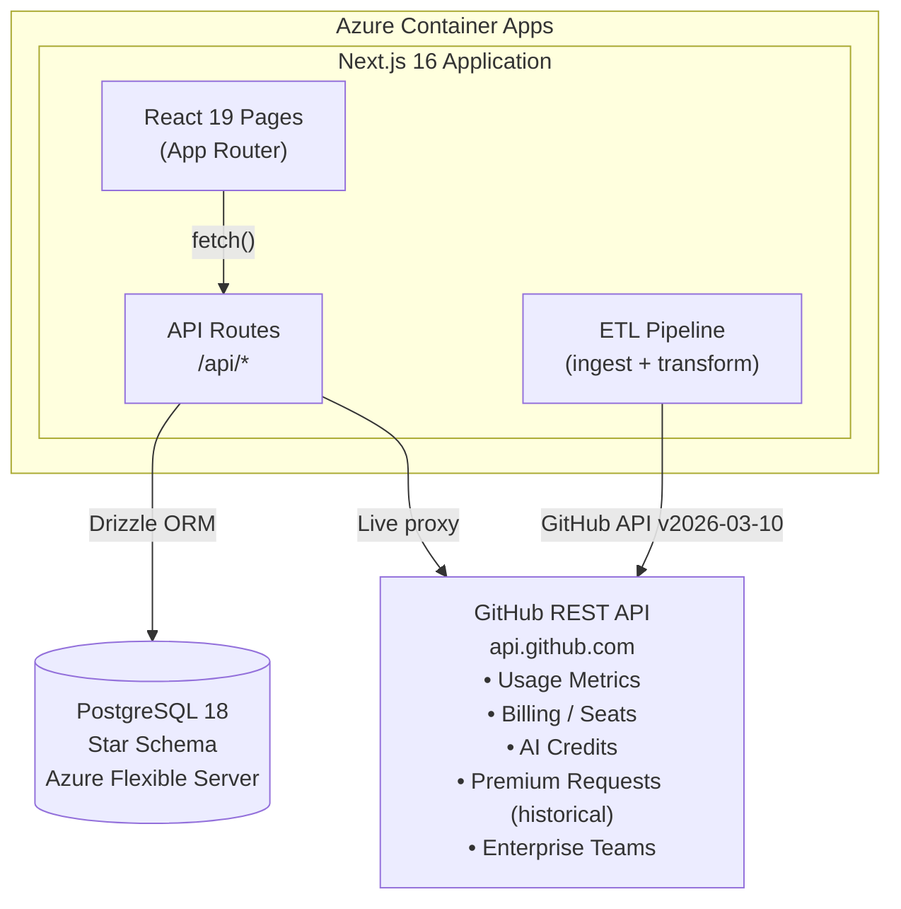
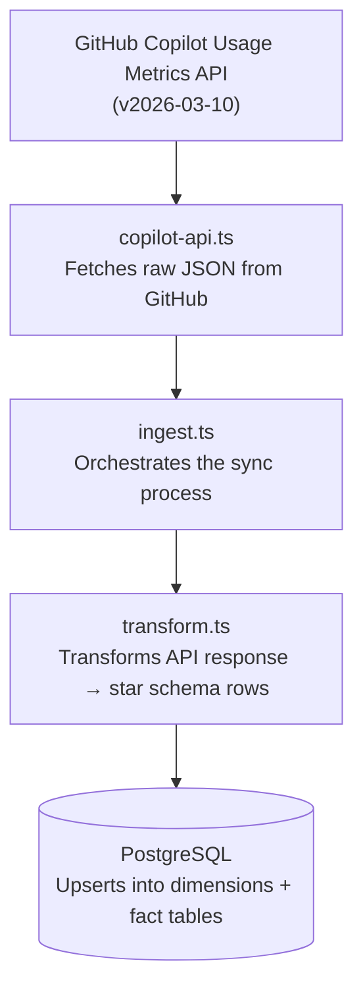
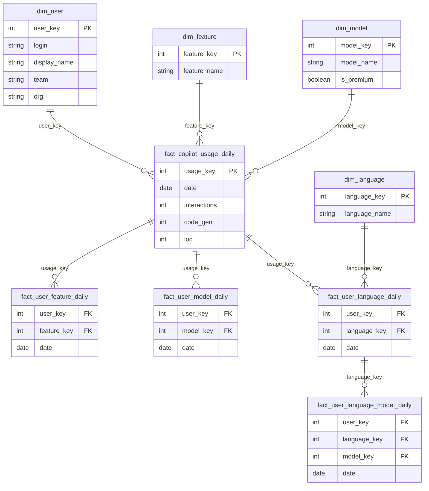
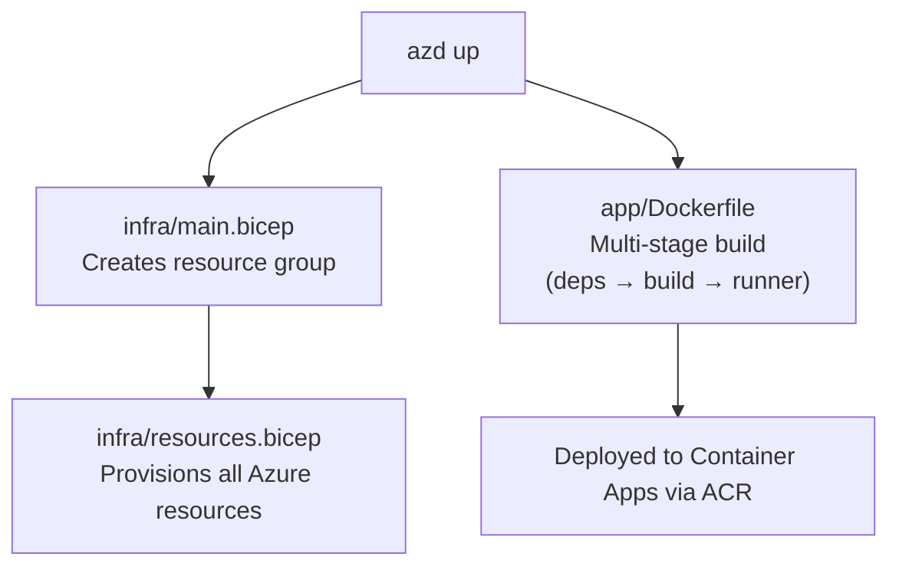
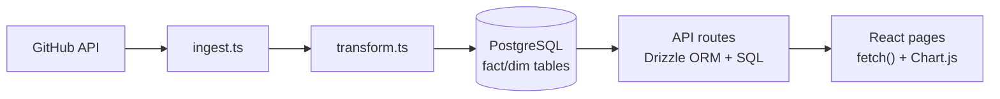
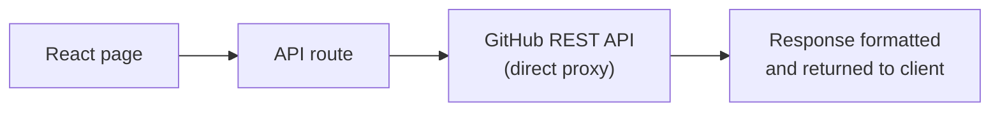

# Architecture

Copilot Insights is an enterprise analytics dashboard for GitHub Copilot usage data. It helps engineering leaders measure adoption, optimize licensing costs, and track AI model activity across their organization. This document describes the system architecture, data flow, and key components.

## System Overview

## Component Architecture

### Frontend (React 19 + Next.js App Router)

All dashboard pages are client components using `"use client"` that fetch data from internal API routes. Chart rendering uses `react-chartjs-2` (Chart.js 4.5).

| Component | Purpose |
|---|---|
| `components/layout/sidebar.tsx` | Main navigation sidebar with theme/locale switchers |
| `components/layout/report-filters.tsx` | Shared date range picker + org/team/user multi-select filters |
| `components/layout/report-banner.tsx` | Shared “About this report” banner shown on report pages |
| `components/layout/breadcrumb.tsx` | Page breadcrumb navigation |
| `components/layout/configuration-banner.tsx` | Banner shown when GitHub token or enterprise slug is missing |
| `components/ui/data-table.tsx` | Sortable, paginated data table with search, filter, and CSV/Excel export |
| `components/ui/multi-select.tsx` | Searchable multi-select dropdown for chart filters |
| `components/ui/pdf-export.tsx` | One-click PDF generation for all dashboards |
| `components/ui/loading-spinner.tsx` | Loading state with message |
| `components/ui/empty-state.tsx` | Empty state when no data is available |
| `components/auth/admin-gate.tsx` | Admin password gate for settings pages |
| `components/auth/auth-gate.tsx` | Dashboard password gate for all pages |
| `lib/i18n/locale-provider.tsx` | Internationalization provider (en/ar/es/fr) with RTL support |
| `lib/theme/theme-provider.tsx` | Dark/light/system theme provider |
| `lib/theme/chart-theme.tsx` | Theme-aware Chart.js options hook |

### API Layer (Next.js Route Handlers)

All API routes live under `app/src/app/api/` and use Zod for request validation.

| Route | Method | Description |
|---|---|---|
| `/api/metrics/dashboard` | GET | Main usage metrics (active users, completions, models, languages) |
| `/api/metrics/code-generation` | GET | LOC breakdown by feature, model, language |
| `/api/metrics/agents` | GET | Agent adoption, IDE vs Coding Agent breakdown |
| `/api/metrics/ai-adoption` | GET | AI adoption cohorts (code-first, agent-first, multi-agent) |
| `/api/metrics/pull-requests` | GET | PR creation, merge, Copilot code review & autofix metrics |
| `/api/metrics/cli` | GET | CLI sessions, requests, token consumption |
| `/api/metrics/models` | GET | Model catalog with usage stats |
| `/api/metrics/seats` | GET | Live seat data from GitHub Billing API |
| `/api/metrics/ai-credits` | GET | AI credit billing usage, included pool computation, and breakdowns |
| `/api/metrics/premium-requests` | GET | Historical premium request data for pre-AI-credit periods |
| `/api/users` | GET | User-level activity data merged with GitHub license API |
| `/api/filters` | GET | Available filter options (orgs, teams, users) |
| `/api/data-range` | GET | Ingested data date range for banners |
| `/api/enterprise-teams` | GET | List enterprise teams |
| `/api/enterprise-teams/[teamId]/members` | GET | Team member listing |
| `/api/enterprise-teams/sync` | POST | Manual enterprise teams sync |
| `/api/enterprise-teams/sync/stream` | GET | SSE enterprise teams sync progress |
| `/api/ingest` | POST | Trigger data ingest |
| `/api/ingest/stream` | GET | SSE streaming ingest with progress |
| `/api/ingest/upload` | POST | Upload JSON/NDJSON data manually |
| `/api/settings` | GET/PUT/DELETE | Application settings CRUD |
| `/api/settings/orgs` | GET | Discover GitHub organizations |
| `/api/settings/sync-history` | GET | Sync history log |
| `/api/settings/sync-interval` | GET/POST | Background sync interval config |
| `/api/settings/sync-schedule` | GET/POST | Cron-based sync schedule |
| `/api/settings/app-info` | GET | Application info and database status |
| `/api/auth/verify-admin` | POST | Admin password verification |
| `/api/auth/verify-dashboard` | GET/POST | Dashboard access verification |
| `/api/admin/reset` | POST | Database reset |
| `/api/audit-log` | GET | Audit log entries |
| `/api/health` | GET | Health check endpoint |

### ETL Pipeline

The ingest pipeline runs in two modes:

1. **Background Auto-Sync** — A `setInterval` in `instrumentation.ts` (Next.js `register()` hook) fires on a configurable interval.
2. **Manual Sync** — Triggered from the Settings page via Server-Sent Events for real-time progress.

**Key files:**
- `lib/github/copilot-api.ts` — GitHub API client with pagination and rate limiting
- `lib/etl/ingest.ts` — Main ingest orchestration
- `lib/etl/transform.ts` — Data transformation to star schema format
- `lib/github/resolve-display-names.ts` — Resolves GitHub login → display name mapping

## Database Schema

The database follows a **star schema** design optimized for analytics queries.

### Dimension Tables

| Table | Description |
|---|---|
| `dim_date` | Date dimension for calendar-based queries |
| `dim_enterprise` | Enterprise (GitHub Enterprise Cloud) dimension |
| `dim_org` | Organization dimension within an enterprise |
| `dim_user` | SCD Type 2 user dimension (login, display name, team, org) |
| `dim_ide` | IDE/editor dimension (VS Code, JetBrains, etc.) |
| `dim_feature` | Copilot feature/mode dimension (chat, agent, code_completion, etc.) |
| `dim_model` | AI model dimension (GPT-5.4, Claude, Gemini, + display name, premium flag) |
| `dim_language` | Programming language dimension |
| `dim_enterprise_team` | Enterprise team dimension (slug, description, sync timestamp) |
| `dim_enterprise_team_member` | Enterprise team member mapping (user login, role) |

### Fact Tables

| Table | Description |
|---|---|
| `fact_copilot_usage_daily` | One row per user per day — core metrics (interactions, code gen, LOC, mode flags) |
| `fact_user_feature_daily` | One row per user per feature per day |
| `fact_user_ide_daily` | One row per user per IDE per day |
| `fact_user_model_daily` | One row per user per model per feature per day |
| `fact_user_language_daily` | One row per user per language per day |
| `fact_user_language_model_daily` | One row per user per language per model per day |
| `fact_cli_daily` | One row per user per CLI version per day (sessions, requests, tokens) |
| `fact_org_aggregate_daily` | One row per org per day — PR metrics, Copilot code review & autofix data |
| `fact_ai_credit_usage` | Monthly AI credit billing snapshot rows for trailing trends and breakdown analytics |

### Supporting Tables

| Table | Description |
|---|---|
| `raw_copilot_usage` | Raw API response stored as JSONB (for code generation report) |
| `ingestion_log` | Sync history with timestamps and status |
| `app_settings` | Key-value application settings |
| `saved_views` | User-saved filter/view configurations |
| `alert_rules` | Configurable alert thresholds |
| `audit_log` | Admin action audit trail |

### ER Diagram

## Infrastructure (Azure)

Deployed via Azure Developer CLI (`azd`) with Bicep templates.

### Resources

| Resource | SKU | Purpose |
|---|---|---|
| **Container App** | 0.5 vCPU / 1 GiB / scale 0–3 | Hosts the Next.js application |
| **Container App Environment** | — | Managed environment with Log Analytics |
| **PostgreSQL Flexible Server** | B1ms / 32 GB | Relational database |
| **Container Registry** | Basic | Docker image registry |
| **Key Vault** | RBAC | Stores DATABASE_URL, ADMIN_PASSWORD |
| **Application Insights** | — | APM and telemetry |
| **Log Analytics Workspace** | — | Centralized logging |
| **Managed Identity** | User-assigned | RBAC for ACR pull + Key Vault access |

### Deployment Flow

### Security

- All secrets stored in **Azure Key Vault** (not environment variables)
- Container App uses **Managed Identity** for RBAC-based access to ACR and Key Vault
- PostgreSQL firewall allows only Azure services
- Admin settings page protected by password gate
- No public database access

## Data Flow

### Ingested Data (Copilot Usage, Agents, Code Generation)

### Live and Snapshot Data (Seats, AI Credits, Premium Requests, Enterprise Teams)

Seats, Premium Requests, and Enterprise Teams pages call GitHub APIs directly on each request (no database caching) to ensure real-time data. These pages display a "Live from GitHub API" data source banner.

AI Credits uses a hybrid approach: selected-month usage is fetched from GitHub's `/settings/billing/ai_credit/usage` endpoint, then persisted to `fact_ai_credit_usage` so monthly trends remain available across endpoint-era transitions.

## Configuration

Application settings are stored in the `app_settings` database table and managed through the Settings UI:

| Setting | Description |
|---|---|
| GitHub Token | PAT for API access (`manage_billing:copilot`, `read:enterprise`, `read:org`) |
| Enterprise Slug | Enterprise identifier for API queries |
| Sync Scope | Enterprise-wide or org-specific data ingestion |
| Sync Org Logins | Comma-separated org logins (when scope is org-specific) |

The Settings page has four tabs:
1. **Configuration** — Token, enterprise slug, API reference table
2. **Data Sync** — Manual sync trigger, file upload, sync history, schedule config, database management
3. **Audit Log** — Admin action history with search, filter, and export
4. **App Info** — Database status, API version, build info, and required scopes
